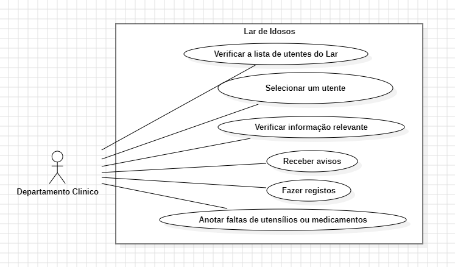
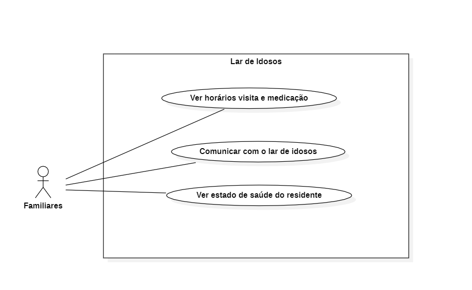
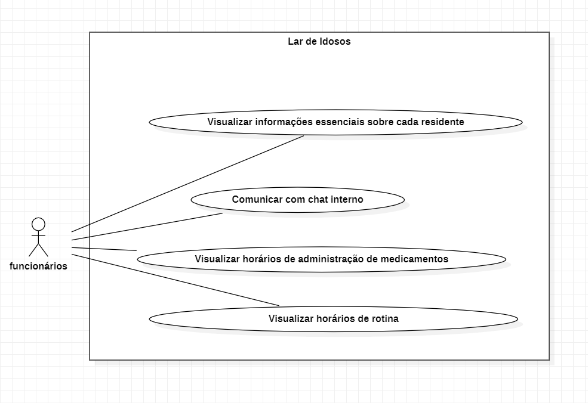
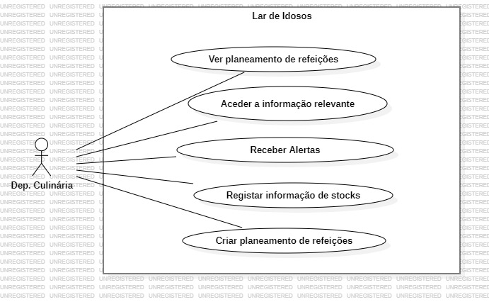
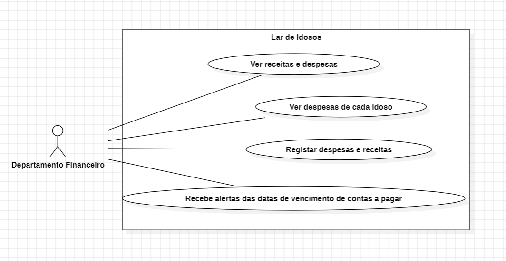

](url)](url)](url))# Project Title

## Contents

- [Team](#team)
- [Vision and Scope](#vision-and-scope)
- [Requirements](#requirements)
    - [Use case diagram](#use-case-diagram)
    - [User stories and prototypes](#user-stories-and-prototypes)
- [Architecture and Design](#architecture-and-design)
    - [Domain Model](#domain-model)
- [Implementation](#implementation)
    - [Product Increment 1](#product-increment-1)
    - [Product Increment 2](#product-increment-2)
    - [Product Increment 3](#product-increment-3)
    - [Product Increment 4](#product-increment-4)

## Team

- Leonardo Silva - 2021135858
- Ricardo Tavares - 2021144652
- Daniel Bravo - 2021137795
- Mário Lourenço - 2021129732
- Sandra Perdigão - 2019102697

***

## Vision and Scope

#### Problem Statement

##### Project background

Atualmente, os Lares de Idosos enfrentam um desafio significativo: a disparidade entre o número de residentes idosos e a quantidade de funcionários disponíveis. Isto resulta em dificuldades na prestação adequada de cuidados individualizados a cada idoso. Ao longo dos anos, esta lacuna tem-se agravando devido ao envelhecimento da população e à crescente procura por serviços de cuidados a idosos, enquanto a oferta de profissionais de saúde e cuidadores não tem acompanhado este aumento. Isto resulta numa sobrecarga de trabalho para os funcionários, o que, por sua vez, pode levar a erros na administração de medicamentos, problemas na alimentação dos idosos e a não conformidade com dietas recomendadas. Sem um sistema de gestão adequado, o bem-estar dos idosos pode estar comprometido.

Nesse contexto, um software de gestão especializado para Lares de Idosos desempenha um papel vital. Além de melhorar a
gestão das necessidades dos idosos e a eficiência dos funcionários, ele também garante a administração precisa de
medicamentos e alimentos, proporcionando assim uma qualidade de vida mais elevada para os idosos e tranquilidade para os
seus entes queridos. Portanto, investir em tecnologia de gestão é essencial para enfrentar os desafios atuais e garantir
um futuro mais seguro e satisfatório para a população idosa nas instituições de cuidados.

_This section contains a summary of the problem that the project will solve. It should provide a brief history of the
problem and an explanation of how the organization justified the decision to build software to address it. This section
should cover the reasons why the problem exists, the organization's history with this problem, any previous projects
that were undertaken to try to address it, and the way that the decision to begin this project was reached._

##### Stakeholders

1. Lar de Idosos

- Departamento Clínico: Necessidade de um sistema de gestão que ajude a administrar eficazmente os cuidados de saúde aos utentes, incluindo registos médicos, administração de medicamentos e acompanhamento de condições de saúde.

- Departamento Culinario: Necessidades relacionadas à gestão de dietas e preferências alimentares dos utentes, bem como alergias alimentares dos utentes e planeamento de refeições individualizado.

- Departamento Financeiro: Necessidades relacionadas à gestão financeira do lar, incluindo informação da prestação de cada utente, controlo de custos, etc.

2. Familiares dos utentes

- Comunicação com o Lar de Idosos: Necessidade de acesso fácil a informações sobre o bem-estar e atendimento aos seus entes queridos, bem como uma linha de Comunicação direta com a equipa do lar.

3. Funcionários

- Gestão dos utentes: Necessidade de uma ferramenta que simplifique o acompanhamento das necessidades indiviuais dos utentes, alocação de tarefas e comunicação interna.

4. Utentes

- Melhores condições: Necessidade de um ambiente seguro, confortável e bem administrado, que inclua cuidados de saúde adequados, nutrição adequada, e atenção personalizada para melhorar a sua qualidade de vida.

_This is a bulleted list of the stakeholders. Each stakeholder may be referred to by name, title, or role ("support
group manager," "CTO," "senior manager"). The needs of each stakeholder are described in a few sentences.

##### Users

1. Lar de Idosos

- Departamento Clínico: Necessidade de um sistema para conter a informação dos medicamentos prescritos para os diferentes utentes, horário de administração, registo de incidentes médicos ou problemas de saúde dos utentes, para um acompanhamento adequado.

- Departamento Culinario: Necessidade de saberas quantidades e tipos de comida a serem preparados a cada dia, levando em consideração alergias alimentares e dietas específicas dos utentes.

- Departamento Financeiro: Necessidade de um sistema que controle as despesas da instituição, incluindo pagamento a funcionários, despesas com alimentação, e outros custos operacionais. Necessidade de registar os pagamentos recebidos por parte dos utentes/ familiares para garantir um registo preciso das finanças do lar.

2. Familiares dos utentes

- Necessidade de um sistema que forneça um chat ou estado do processo do utente, permitindo uma comunicação direta com a equipa do lar. Interesse em informações atualizadas sobre a condição e o bem-estar do utente, para tranquilidade e acompanhamento dos familiares.

3. Funcionários

- Necessidade de um registo que contenha informações sobre as medicações que cada utente precisa de tomar, garantido uma administração precisa. Interesse em que esteja disponível informação sobre cuidados específicos necessários para cada utente, assim como acesso ao horário de visistas dos utentes para coordenar as interações familiares e garantir o bem-estar dos idosos.

_This is a bulleted list of the users. As with the stakeholders, each user can either be referred to by name or role ("
support rep," "call quality auditor," "home web site user")however, if there are many users, it is usually inefficient
to try to name each one. The needs of each user are described._

***

#### Vision & Scope of the Solution

##### Vision statement

O objetivo deste projeto é revolucionar a Gestão de Lares de Idosos, para isso será necessário desenvolver um software bastante completo e complexo. Este software não só melhorará a qualidade de vida dos idosos residentes em lares, como também permitirá aos funcionários/utilizadores realizarem as suas tarefas mais acertadamente uma vez que será possivel aceder aos mais diversos dados relativos a cada idoso facilitando o seu trabalho.
Atendendo a estas necessidades críticas dos funcionários e idosos pretende-se ajudar a criar um ambiente mais acolhedor para os residentes de lares.

_The goal of the vision statement is to describe what the project is expected to accomplish. It should explain what the
purpose of the project is. This should be a compelling reason, a solid justification for spending time, money, and
resources on the project. The best time to write the vision statement is after talking to the stakeholders and users and
writing down their needs; by this time, a concrete understanding of the project should be starting to jell._

##### List of features

**Gestão de Medicamentos**

- Providenciar uma plataforma segura na qual os funcionários responsáveis pelos idosos possam verificar a medicação a ser tomada.
- Manter um registo detalhado dos horários da toma dos medicamentos.
- Alertas para os horários de administração de medicamentos.

**Gestão Dietética**

- Planos de refeições personalizados para os idosos tendo em conta as suas restrições dietéticas e alergias.

**Gestão de Pessoal**

- Manter uma base de dados com todos os funcionários do lar,contendo as suas funções e horários.
- Permitir que todos os funcionários tenham acesso aos registos das informações sobre os idosos

**Gestão de Perfis dos Residentes**

- Criar perfis para novos residentes, incluido alergias, preferências ao nivel da alimentação e informações pessoais.
- Armazenar na base de dados fotografias e documentação importante relacionados aos residentes.

**Alertas e Notificações**

- Envio de alertas aquando a realização de eventos críticos, aniversários, erros de medicação, entre outros.

_This section contains a list of features. A feature is as a cohesive area of the software that fulfills a specific need
by providing a set of services or capabilities. Any software package, in fact, any engineered product, can be broken
down into features. The project manager can choose the number of features in the vision and scope document by changing
the level of detail or granularity of each feature, and by combining multiple features into a single one. Sometimes
those features are small ("screw-top cap," "holds one liter of liquid"); sometimes they are big ("four-wheel drive," "
seats seven passengers"). It is useful to describe a product in about 10 features in the vision and scope document,
because this usually yields a level of complexity that most people reading it are comfortable with. Adding too many
features will overwhelm most readers._

_Each feature should be listed in a separate paragraph or bullet point. It should be given a name, followed by a
description of the functionality that it provides. This description does not need to be detailed; it can simply be a few
sentences that give a general explanation of the feature. However, if there is more information that a stakeholder or
project team member feels should be included, it is important to include that information. For example, it is sometimes
useful to include a use case (see Chapter 6), as long as it is written in such a way that all of the stakeholders can
read and understand it._

##### Features that will not be developed

- Não incluiremos a funcionalidade de processar pagamentos para funcionários, fornecedores, utentes.

- Não abordaremos a gestão de stock de alimentos.

- Não haverá integração com sistemas externos de saúde ou segurança social.

- Não iremos desenvolver um sistema de diálogo entre funcionários, familiares e utentes.

_Features are often left out of a project on purpose. When a feature is explicitly left out of the software, it should be
added to this section to tell the reader that a decision was made to exclude it. For example, one way to handle an
unrealistic deadline is by removing one or more features from the software, in which case the removed features should be
moved into this section. The reason these features should be moved rather than deleted from the document is that
otherwise, readers might assume that they were overlooked and bring them up in a review. This is especially important
during the review of the document because it allows everyone to agree on the exclusion of the feature (or object to it)._

##### Risk

1. Risco de violações de segurança de dados que podem comprometer informações sensíveis dos idosos.
2. Risco de resistência por parte dos funcionários e da equipa de cuidados aos idosos em relação à adoção da nova tecnologia.
3. Risco de dados incorretos ou imprecisos devido a erros de entrada por parte dos utilizadores autorizados.
4. Risco de falhas técnicas na aplicação que poderiam interromper o funcionamento.

_Risks are potential uncertainties or adverse events that can impact the achievement of objectives and require proactive
management to mitigate or minimize their negative effects._

##### Assumptions

1. A primeira versão da aplicação será um protótipo disponível como uma aplicação de desktop.
2. A aplicação não recolhe dados por si só, em vez disso, os utilizadores autorizados para cada secção inserem informações dos utentes, das finanças do lar, etc. 
3. Parte-se do pressuposto de que os utilizadores inserirão dados fiáveis e precisos apensar das verificações impostas pelo software. 
4. A aplicação vai ser desenvolvida para uma única instituição de apoio a idosos que contém 5 funcionários e 20 residentes, cada um com informações únicas. 
5. Supõe-se que os utilizadores serão treinados e orientações para usar a aplicação de forma eficaz.

_This is the list of assumptions that the stakeholders, users, or project team have made. The team should hold a
brainstorming session to come up with a list of assumptions. (See Chapter 3 for more information on assumptions.)_

***

## Requirements

#### Use Case Diagram

***

##### Use Case 1

- Actor: Actor x
- Description: Description of use case number 1
- Preconditions:
    - Precondition 1
    - Precondition 2
    - Without preconditions
- Postconditions:
    - Postcondition 1
    - Postcondition 2
    - Without postcondition
- Normal flow:
    - The user ...
    - The user ...
- Alternative flows:
    - The user ...
    - The user ...

***

##### Use Case 2

***

##### Use Case 3

***

#### User Stories and Prototypes

***

##### User Story 1

**Departamento Clínico**

Como enfermeira do departamento clínico de um lar de idosos quero controlar a administração da medicação dos utentes, bem como fazer o seu acompanhamento do estado de saúde, para isso preciso de ter acesso á informação da medicação e problemas de saúde de cada utente.

###### Acceptance Criteria

1. Quando o enfermeiro entra no sistema, deve ser capaz de verificar a lista de todos os utentes do lar.

2. Deve ser capaz de selecionar o utente do qual pretende obter informação.

3. O enfermeiro deve ter acesso á informação relativa a: tipo de medicamento a tomar, dosagem, hórario da toma do medicamento, várias informações relativas ao seu estado de saúde, e outras informações que possam ser importantes a estes.

4. Os enfermeiros devem receber avisos sobre a aproximação da hora de administração da medicação de um determinado utente.

5. Devem ser capazes de registar no sistema a toma ou não da medicação, bem como registar no sistema qualquer tipo de problemas de saúde ou incidentes na toma da medicação.

6. Deve ser possivel registar a falta de medicamentos, bem como a falta de utensílios essenciais ao trabalho do enfermeiro.

###### Prototype

***

##### User Story 2

Como familiar eu quero ter uma maior proximidade com o utente presente no lar,
visto que eu quero conseguir saber o bem-estar, saúde e ter uma comunicação mais fácil.

###### Acceptance Criteria

1. Quando um familiar entra no sistema, deve ser capaz de ver o horario de visita e da medicação
2. Deve ser capaz de ter acesso a um chat para comunicar com o utente
3. Deve ser capaz de ter acesso ao estado de saúde do utente

###### Prototype

***

##### User Story 3

Como funcionário de um lar de idosos, eu quero poder acessar o sistema para saber quais tarefas a realizar, saber horários de entrada e saída, assim como horas de levantar e deitar utentes. 

###### Acceptance Criteria

1. Deve ser possível visualizar informações essenciais sobre cada residente, incluindo seu nome, idade, histórico médico relevante e quaisquer alergias.

2. Deve haver uma funcionalidade de chat que permita aos funcionários se comunicarem entre si, para uma maior cooperação entre si e troca de turnos em casos de necessidade.

3. Deve ser possível acessar um registro de horários de administração de medicamentos para cada residente onde se pode obter informações relativas aos medicamentos a serem administrados, as doses e os horários.

4. Deve ser possível acessar um registro de horários de rotina para cada residente onde se pode obter informações relativas a horas de acordar e deitar, assim como banhos, trocas de fraldas, atividades didáticas e horas de visita.

###### Prototype

***
##### User Story 4

**Departamento Culinário**

Como funcionária no Departamento Culinario de um lar de idosos, quero controlar o planeamento das refeições, garantir que as preferências alimentares e restrições dietéticas dos idosos sejam consideradas, e manter registo de stock para garantir que os ingredientes estejam sempre disponíveis.

###### Acceptance Criteria

1. Quando a funcionária do Departamento Culinario entra no sistema, deve poder visualizar o planeamento de refeições para os idosos.

2. Deve ser possível aceder a informações sobre as preferências alimentares e restrições dietéticas de cada idoso, incluindo alergias.

3. Deve receber alertas sobre restrições ou preferências alimentares especiais ao planear refeições, para garantir que as necessidades de cada idoso sejam correspondidas.

4. A funcionária do Departamento Culinario pode registar informações sobre o stock de ingredientes, incluindo datas de validade e datas de reposição previstas.

5. Deve ser possível criar um plano de refeições semanal, tendo em consideração as preferências e restrições dos idosos.

###### Prototype

A prototype of user story 4 should be here. You can see in (#use-case-diagram) how to import an image.

***

##### User Story 5

**Departamento Financeiro**

Como membro da equipe financeira de um lar de idosos, quero ser capaz de gerenciar as finanças da instituição de forma eficaz e transparente. Para isso, preciso ter acesso às informações financeiras relevantes, tais como gastos alimentares, despesas com energia, água, cuidados médicos, manutenção de instalações e outras despesas operacionais essenciais.

###### Acceptance Criteria

1. Ao acessar o sistema, o membro da equipe financeira deve ser capaz de visualizar um resumo das finanças da instituição, incluindo receitas e despesas totais.

2. Deve ser possível acessar detalhes financeiros específicos, como relatórios de despesas mensais de cada idoso.

3. Devem ser capazes de registar despesas adicionais e receitas inesperadas no sistema, de forma que as finanças sejam sempre atualizadas e precisas.

4. Os membros da equipe financeira devem ser alertados sobre datas de vencimento de contas a pagar, para que não haja pagamentos em atraso.

###### Prototype

A prototype of user story 5 should be here. You can see in (#use-case-diagram) how to import an image.

***

## Architecture and Design

#### Domain Model

A domain model should be here. You can see in (#use-case-diagram) how to import an image.

***

## Implementation

#### Product Increment 1

##### Sprint Goal

The sprint goal was ...

##### Planned vs Implemented

For this iteration we planned to implement the:

- Feature 1
- Feature 2

For this iteration we implemented the:

- Feature 1
- Feature 2

##### Sprint Retrospective

- What we did well:
    - A
- What we did less well:
    - B
- How to improve to the next sprint:
    - C

***

#### Product Increment 2

***

#### Product Increment 3

***

#### Product Increment 4

***
