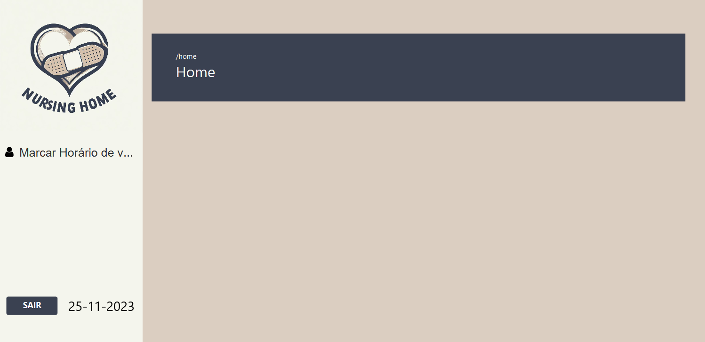
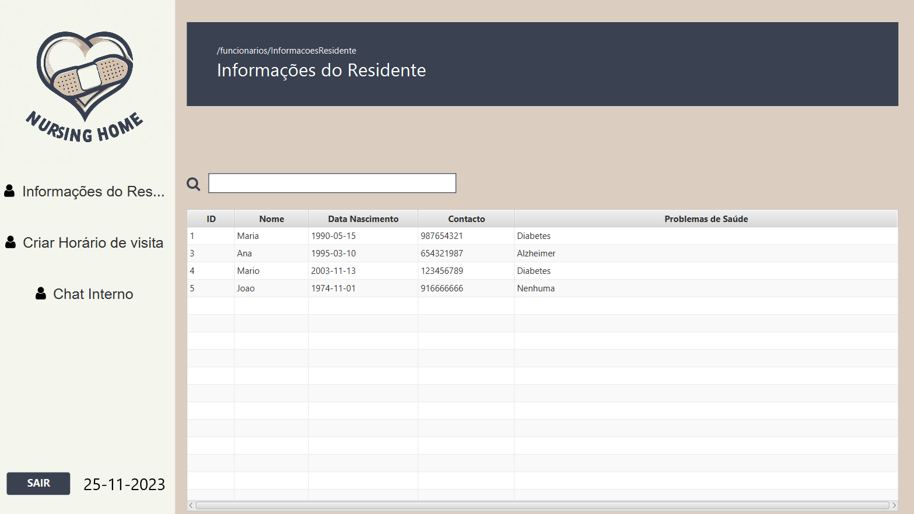
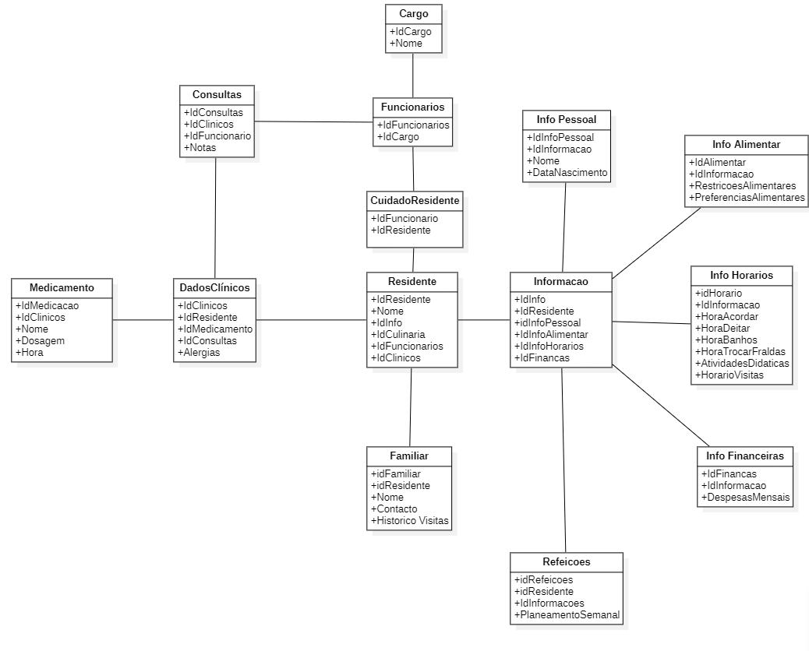

# Software de gestão para lar de idosos

## Contents

- [Team](#team)
- [Vision and Scope](#vision-and-scope)
- [Requirements](#requirements)
    - [Use case diagram](#use-case-diagram)
    - [Mockups](#mockups)
    - [User stories](#user-stories)
- [Definition of Done](#definition-of-done)
- [Architecture and Design](#architecture-and-design)
    - [Domain Model](#domain-model)
- [Risk Plan](#risk-plan)
- [Pre-Game](#pre-game)
- [Release Plan](#release-plan)
  - [Release 1](#release-1)
  - [Release 2](#release-2)
- [Increments](#increments)
  - [Sprint 1](#sprint-1)
  - [Sprint 2](#sprint-2)
  - [Sprint 3](#sprint-3)

## Team

- Daniel Bravo - 2021137795
- Leonardo Silva - 2021135858
- Mário Lourenço - 2021129732
- Ricardo Tavares - 2021144652
- Sandra Perdigão - 2019102697

***

## Vision and Scope

#### Problem Statement

##### Project background

Atualmente, os Lares de Idosos enfrentam um desafio significativo: a disparidade entre o número de residentes idosos e a quantidade de funcionários disponíveis. Isto resulta em dificuldades na prestação adequada de cuidados individualizados a cada idoso. Ao longo dos anos, esta lacuna tem-se agravando devido ao envelhecimento da população e à crescente procura por serviços de cuidados a idosos, enquanto a oferta de profissionais de saúde e cuidadores não tem acompanhado este aumento. Isto resulta numa sobrecarga de trabalho para os funcionários, o que, por sua vez, pode levar a erros na administração de medicamentos, problemas na alimentação dos idosos e a não conformidade com dietas recomendadas. Sem um sistema de gestão adequado, o bem-estar dos idosos pode estar comprometido.

Nesse contexto, um software de gestão especializado para Lares de Idosos desempenha um papel vital. Além de melhorar a
gestão das necessidades dos idosos e a eficiência dos funcionários, ele também garante a administração precisa de
medicamentos e alimentos, proporcionando assim uma qualidade de vida mais elevada para os idosos e tranquilidade para os
seus entes queridos. Portanto, investir em tecnologia de gestão é essencial para enfrentar os desafios atuais e garantir
um futuro mais seguro e satisfatório para a população idosa nas instituições de cuidados.

**1. Lar de Idosos**

- Departamento Clínico: Necessidade de um sistema de gestão que ajude a administrar eficazmente os cuidados de saúde aos utentes, incluindo registos médicos, administração de medicamentos e acompanhamento de condições de saúde.

- Departamento Culinario: Necessidades relacionadas à gestão de dietas e preferências alimentares dos utentes, bem como alergias alimentares dos utentes e planeamento de refeições individualizado.

- Departamento Financeiro: Necessidades relacionadas à gestão financeira do lar, incluindo informação da prestação de cada utente, controlo de custos, etc.

- Animador: Necessidades relacionadas à gestão das atividades recreativas do lar, bem como o registo de participação dos utentes.

**2. Familiares dos utentes**

- Comunicação com o Lar de Idosos: Necessidade de acesso fácil a informações sobre o bem-estar e atendimento aos seus entes queridos, bem como uma linha de Comunicação direta com a equipa do lar.

**3. Funcionários**

- Gestão dos utentes: Necessidade de uma ferramenta que simplifique o acompanhamento das necessidades indiviuais dos utentes, alocação de tarefas e comunicação interna.

**4. Utentes**

- Melhores condições: Necessidade de um ambiente seguro, confortável e bem administrado, que inclua cuidados de saúde adequados, nutrição adequada, e atenção personalizada para melhorar a sua qualidade de vida.

##### Users
**1. Lar de Idosos**

- Departamento Clínico: Necessidade de um sistema para conter a informação dos medicamentos prescritos para os diferentes utentes, horário de administração, registo de incidentes médicos ou problemas de saúde dos utentes, para um acompanhamento adequado.

- Departamento Culinario: Necessidade de saber as quantidades e tipos de comida a serem preparados a cada dia, levando em consideração alergias alimentares e dietas específicas dos utentes.

- Departamento Financeiro: Necessidade de um sistema que controle as despesas da instituição, incluindo pagamento a funcionários, despesas com alimentação, e outros custos operacionais. Necessidade de registar os pagamentos recebidos por parte dos utentes/ familiares para garantir um registo preciso das finanças do lar.

- Animador: Necessidade de um sistema que controle a participação dos utentes nas atividades, assim como gerir as diversas atividades(criar, editar e apagar).

**2. Familiares dos utentes**

- Necessidade de um sistema que forneça um chat ou estado do processo do utente, permitindo uma comunicação direta com a equipa do lar. Interesse em informações atualizadas sobre a condição e o bem-estar do utente, para tranquilidade e acompanhamento dos familiares.

**3. Funcionários**

- Necessidade de um registo que contenha informações sobre as medicações que cada utente precisa de tomar, garantido uma administração precisa. Interesse em que esteja disponível informação sobre cuidados específicos necessários para cada utente, assim como acesso ao horário de visistas dos utentes para coordenar as interações familiares e garantir o bem-estar dos idosos.

***

#### Vision & Scope of the Solution

##### Vision statement

O objetivo deste projeto é revolucionar a Gestão de Lares de Idosos, para isso será necessário desenvolver um software bastante completo e complexo. Este software não só melhorará a qualidade de vida dos idosos residentes em lares, como também permitirá aos funcionários/utilizadores realizarem as suas tarefas mais acertadamente uma vez que será possivel aceder aos mais diversos dados relativos a cada idoso facilitando o seu trabalho.
Atendendo a estas necessidades críticas dos funcionários e idosos pretende-se ajudar a criar um ambiente mais acolhedor para os residentes de lares.

##### List of features

**Gestão de Medicamentos**

- Providenciar uma plataforma segura na qual os funcionários responsáveis pelos idosos possam verificar a medicação a ser tomada.
- Manter um registo detalhado dos horários da toma dos medicamentos.
- Alertas para os horários de administração de medicamentos.

**Gestão Dietética**

- Planos de refeições personalizados para os idosos tendo em conta as suas restrições dietéticas e alergias.

**Gestão de Pessoal**

- Manter uma base de dados com todos os funcionários do lar,contendo as suas funções e horários.
- Permitir que todos os funcionários tenham acesso aos registos das informações sobre os idosos

**Gestão de Perfis dos Residentes**

- Criar perfis para novos residentes, incluido alergias, preferências ao nivel da alimentação e informações pessoais.
- Armazenar na base de dados fotografias e documentação importante relacionados aos residentes.

**Alertas e Notificações**

- Envio de alertas por parte da gerência aquando a realização de eventos críticos, aniversários, erros de medicação, entre outros.

##### Features that will not be developed

- Não incluiremos a funcionalidade de processar pagamentos para funcionários, fornecedores, utentes.

- Não abordaremos a gestão de stock de alimentos.

- Não haverá integração com sistemas externos de saúde ou segurança social.

- Não iremos desenvolver um sistema de diálogo entre funcionários, familiares e utentes.

- Não iremos gerenciar as finanças da instituição.

##### Assumptions

1. A primeira versão da aplicação será um protótipo disponível como uma aplicação de desktop.
2. A aplicação não recolhe dados por si só, em vez disso, os utilizadores autorizados para cada secção inserem informações dos utentes, das finanças do lar, etc.
3. Parte-se do pressuposto de que os utilizadores inserirão dados fiáveis e precisos apensar das verificações impostas pelo software.
4. A aplicação vai ser desenvolvida para uma única instituição de apoio a idosos que contém 5 funcionários e 20 residentes, cada um com informações únicas.
5. Supõe-se que os utilizadores serão treinados e orientações para usar a aplicação de forma eficaz.

***

## Requirements

### Use Case Diagram

***

### Mockups

**Login**

**Departamento Clínico**
Os funcionários do departamento clínico podem verificar a lista de utentes, registar a administração de medicamentos, registar problemas de saúde, receber avisos e fazer anotações.

**Familiares**
Os familiares poderam agendar visitas, controlar as medicações e verificar o estado de saúde do utente.

**Funcionários**
Os funcionários terão acesso a informações dos utentes, chat entre outros funcionários para assuntos diversos, cuidar da administração de medicamentos e rotinas de utentes.

  

**Departamento Culinária**
Os funcionários do departamento de culinária podem fazer planeamento de refeições e analisar informações culinárias de cada utente. Além disso, poderão registar stocks e receber alertas.

**Departamento Financeiro**
Os funcionários do departamento financeiro poderão analisar e adicionar despesas e receitas a nível geral da instituição, assim como analisar e adicionar despesas individuais de utentes.

**Gerência**
Os elementos da gerência terão acesso a diversas informações sobre cada utente, assim como poderão criar vários tipos de avisos.

 

***

### User Stories

##### User Stories list

- [US1: Como enfermeira do Dep. Clinico quero registar em um residente as suas consultas e medicações.](https://gitlab.com/ShorMario/gps_g33/-/issues/3)
- [US2: Como enfermeira do Dep. Clinico quero registar a falta de medicação e utensílios.](https://gitlab.com/ShorMario/gps_g33/-/issues/2)
- [US3: Como membro do Dep. Financeiro quero Visualizar as receitas e despesas do lar de idosos](https://gitlab.com/ShorMario/gps_g33/-/issues/63)
- [US4: Como membro do Dep. Financeiro quero receber alertas das faturas que estão proximas de vencer](https://gitlab.com/ShorMario/gps_g33/-/issues/64)
- [US5: Como membro do Dep. Financeiro quero visualizar as despesas de residentes em especifico](https://gitlab.com/ShorMario/gps_g33/-/issues/65)
- [US6 - Como familiar quero ter uma comunicação com o lar de idosos](https://gitlab.com/ShorMario/gps_g33/-/issues/30)
- [US7 - Como Familiar eu quero visualizar as consultas do utente](https://gitlab.com/ShorMario/gps_g33/-/issues/33)
- [US8: Como Funcionario eu quero comunicar com outros funcionarios e departamentos](https://gitlab.com/ShorMario/gps_g33/-/issues/67)
- [US9: Como Funcionario eu quero Visualizar as informações do residente](https://gitlab.com/ShorMario/gps_g33/-/issues/68)
- [US10: Como Gerente eu quero gerir os residentes (Criar,Apagar,Editar)](https://gitlab.com/ShorMario/gps_g33/-/issues/5)
- [US11: Como Gerente eu quero criar avisos para todos os funcionarios](https://gitlab.com/ShorMario/gps_g33/-/issues/4)
- [US12: Como Gerente eu quero gerir os funcionarios(Criar,Apagar,Editar)](https://gitlab.com/ShorMario/gps_g33/-/issues/1)
- [US13: Como Animador eu quero conseguir gerir as atividades (Criar,Apagar,Editar)](https://gitlab.com/ShorMario/gps_g33/-/issues/61)
- [US14: Como Animador eu quero registar a participação do residente na atividade](https://gitlab.com/ShorMario/gps_g33/-/issues/62)
- [US15: Como cozinheira/o no Dep. Culinario eu quero gerir o stock dos alimentos](https://gitlab.com/ShorMario/gps_g33/-/issues/29)
- [US16: US16: Como cozinheira/o no Dep. Culinário eu quero criar/editar/apagar restrições e preferências alimentares dos residentes](https://gitlab.com/ShorMario/gps_g33/-/issues/28)
- [US17: Como cozinheira/o no Dep. Culinario eu quero gerir o planeamento de refeições (Criar,Apagar,Editar)](https://gitlab.com/ShorMario/gps_g33/-/issues/6)

***

## Definition of done

(This section is already written, do not edit)
It is a collection of criteria that must be completed for a User Story to be considered “done.”

- All tasks done
  - CI – built, tested (Junit), reviewed (SonarCloud)
  - Merge request to qa (code review)

- Acceptance tests passed

- Accepted by the client

- Code merged to main

***

## Architecture and Design

#### Domain Model

***

### Risk

##### Threshhold of Success

Para que o projeto seja bem sucedido, devemos ter:
- ≥ 50% das ‘user’ stories concluídas
- Acompanhamento da medicação e problemas de saúde de cada utente
- Permitir a gestão de tarefas dos funcionários

**(Adicionar mais)**

##### Risk List

**RSK1 Falta de Experiência em Desenvolvimento de Software**
- RSK1 – PxI: 3x5=15 Nem todos os membros da equipa têm experiência em desenvolvimento de ‘software’ em java o que pode levar a atrasos no desenvolvimento do projeto.

**RSK2 Resistência à mudança**
- RSK2 – PxI: 3x4=12; Pode haver resistência por parte dos funcionários e da equipa de cuidados aos idosos relativamente à adoção da nova tecnologia.

**RSK3 Erros nos dados de entrada**
- RSK3 – PxI: 1x5=5; Pode haver dados incorretos ou imprecisos devido a erros de entrada por parte dos utilizadores autorizados, no entanto com o avançar do projeto a equipa está a fazer validações dos dados de entrada.

**RSK4 Falhas técnicas**
- RSK4 – PxI: 2x5=10; Pode haver falhas técnicas na aplicação que poderiam interromper o funcionamento.

**RSK5 Violações de segurança**
- RSK5 – PxI: 3x5=15; Pode haver violação de segurança de dados que pode comprometer as informações sensíveis dos idosos.

##### Mitigation Actions
(threats>=20)

**Nota:** _Contingency Plan (CP), Avoidance Strategy (AS) or Minimization Strategy (MS)_

***

## Pre-Game
### Sprint 0 Plan

- Goal: Terminar o README e as Mockups do projeto.

- Dates: from 10-13/Oct to 24-27/Oct, 2 weeks

- Roles:
  - Product Owner: Ricardo Tavares
  - Scrum Master: Leonardo Silva

- Sprint 0 Backlog (don't edit this list):
  - Task1 – Write Team
  - Task2 – Write V&S
  - Task3 – Write Requirements
  - Task4 – Write DoD
  - Task5 – Write Architecture&Design
  - Task6 – Write Risk Plan
  - Task7 – Write Pre-Gane
  - Task8 – Write Release Plan
  - Task9 – Write Product Increments
  - Task10 – Create Product Board
  - Task11 – Create Sprint 0 Board
  - Task12 – Write US in PB, estimate (SML), prioritize (MoSCoW), sort
  - Task13 – Create repository with “GPS Git” Workflow

***

## Release Plan

### Release 1

- Goal: MVP - Na primeira versão, o nosso objetivo é implementar para a gerencia a gestão de residente e a administração de funcionários  assim como o planeamento das refeições no Departamento de Culinária.

- Dates:  from 24-27/Oct to 28-30/Nov
- Release: V1.0

***

### Release 2

- Goal: Para a versão final,iremos introduzir a opção de visualizar residentes para os funcionários, no Departamento Culinário iremos ter a capacidade de visualizar as restrições alimentares de cada residente, enquanto no Departamento Clínico, disponibilizaremos o registo de consultas e informações sobre a medicação do residente.

- Date: 12-15/Dec
- Release: V2.0

***

## Increments

### Sprint 1
##### Sprint Plan

- Goal: Desenvolver todas as funcionalidades relativas aos Funcionários e Familiares.

- Dates: from 24-27/Oct to 14-17/Nov, 3 weeks

- Roles:
  - Product Owner: Daniel Bravo
  - Scrum Master: Ricardo Tavares

- To do:
  - **US10 - Como Gerente eu quero gerir os residentes (Criar,Apagar,Editar)**
    - Task1 - Tratar da lógica do botão Adicionar (Alterar a cena para o Modal Adicionar) - 1H
    - Task2 - Tratar da lógica do botão Editar (Alterar a cena para o Modal Editar) - 1H
    - Task3 - Tratar da lógica do botão Apagar (Selecionar qual residente eliminar e retirar da tabela) - 1H
    - Task4 - Criação da cena em SceneBuilder para a janela "Residentes". - 1H
    - Task5 - Criação da cena em SceneBuilder para a janela de "Criar Residentes" á tabela. - 1H
    - Task6 - Criação da cena em SceneBuilder para a janela de "Editar Residentes". - 1H
    - Task7 - Tratar da lógica do TextField para procura de residentes. - 1H
    - Task8 - Tratar de colocar a hora correta na label perto do botão Sair. - 1H
    - Task9 - Tratar da lógica de adicionar um residente á tabela de Residentes. - 1H
    - Task10 - Tratar da lógica de editar informações sobre os Residentes. - 2H
    - Task11 - Tratar da lógica da tabela para amostra de todos os utentes. - 1H 

  - **US12 - Como Gerente eu quero gerir os funcionarios(Criar,Apagar,Editar)**
  
    - Task1 - Tratar da lógica do botão Adicionar (Alterar a cena para o Modal Adicionar) - 1H
    - Task2 - Tratar da lógica do botão Editar (Alterar a cena para o Modal Editar) - 1H
    - Task3 - Tratar da lógica do botão Apagar (Selecionar qual funcionário eliminar e retirar da tabela) - 1H
    - Task4 - Criação da cena em SceneBuilder para a janela "Funcionários". - 1H
    - Task5 - Criação da cena em SceneBuilder para a janela de "Criar Funcionários" á tabela. - 1H
    - Task6 - Criação da cena em SceneBuilder para a janela de "Editar Funcionário". - 1H
    - Task7 - Tratar da lógica do TextField para procura de funcionários. - 1H
    - Task8 - Tratar de colocar a hora correta na label perto do botão Sair. - 1H
    - Task9 - Tratar da lógica de adicionar um funcionário á tabela de Funcionários. - 1H
    - Task10 - Tratar da lógica de editar informações sobre os Funcionários. - 2H
    - Task11 - Tratar da lógica da tabela para amostra de todos os funcionários. - 1H

  - **US17 - Como cozinheira/o no Dep. Culinario eu quero gerir o planeamento de refeições (Criar,Apagar,Editar)**

    - Task1 - Tratar da lógica do botão Adicionar (Alterar a cena para o Modal Adicionar) - 1H
    - Task2 - Tratar da lógica do botão Editar (Alterar a cena para o Modal Editar) - 1H
    - Task3 - Tratar da lógica do botão Apagar (Selecionar qual refeição eliminar e retirar da tabela) - 1H
    - Task4 - Criação da cena em SceneBuilder para a janela "Refeições". - 1H
    - Task5 - Criação da cena em SceneBuilder para a janela de "Nova Refeição" á tabela. - 1H
    - Task6 - Criação da cena em SceneBuilder para a janela de "Editar Refeição". - 1H
    - Task7 - Tratar da lógica do TextField para procura de refeições. - 1H
    - Task8 - Tratar de colocar a hora correta na label perto do botão Sair. - 1H
    - Task9 - Tratar da lógica de adicionar uma refeição á tabela de Refeições. -1H
    - Task10 - Tratar da lógica de editar a refeição. -2H
    - Task11 - Tratar da lógica da tabela para amostra de todas as refeições - 1H
    - Task12 - Tratar da lógica da tabela da janela "Nova Refeição", para mostragem de todos os residentes (Nome e NIF). - 1H
    - Task13 - Tratar da lógica da possibilidade de selecionar um utente para associar á refeição.- 1H
    - Task14 - Tratar da lógica do botão "toggle" de forma a indicar que a refeição é direcionada a todos os utentes. - 1H
    - Task15 - Tratar da lógica do botão "Radio Buttons" para guardar o tipo de refeição. - 1H 
    - Task16 - Tratar da lógica do TextField para procura de residentes. - 1H
    - Task17 - Tratar da lógica da tabela para mostrar de todos os residentes. - 1H 

  - **US1 - Como enfermeira do Dep. Clinico quero registar em um residente as suas consultas e medicações.** (Veio da Product Backlog)

    - Task1 - Tratar da lógica do botão Adicionar (Alterar a cena para o Modal Adicionar) - 1H
    - Task2 - Tratar da lógica do botão Editar (Alterar a cena para o Modal Editar) - 1H
    - Task3 - Tratar da lógica do botão Apagar (Selecionar o que eliminar e retirar da tabela) - 1H
    - Task4 - Criação da cena em SceneBuilder para a janela "Consultas&Medicação" do utente. - 1H
    - Task5 - Criação da cena em SceneBuilder para a janela de "Adicionar Consultas e Medicação" do utente á tabela. - 1H
    - Task6 - Criação da cena em SceneBuilder para a janela de "Editar Consultas e Medicação" do utente. - 1H
    - Task7 - Tratar da lógica do TextField para procura de utentes. - 1H
    - Task8 - Tratar de colocar a hora correta na label perto do botão Sair. -1H 
    - Task9 - Tratar da lógica de adicionar uma Consulta&Medicação á tabela do utente. - 1H
    - Task10 - Tratar da lógica de editar informações sobre as Consultas&Medicações do utente na tabela. - 2H
    - Task11 - Tratar da lógica da ListView dentro do modal para procura do utente a associar á consulta ou medicação. - 3H
    - Task12 - Tratar da lógica da tabela para amostra das consultas e medicações associadas a cada utente. - 1H 

    
- Story Points: Small: 0, Medium: 0, Large: 4; Total = 0S + 0M + 4L = 0S 0M 55L 

- Analysis: short analysis of the planning meeting

##### Sprint Review

- Analysis: 

  **Adicionado**: 
  - [US1: Como enfermeira do Dep. Clinico quero registar em um residente as suas consultas e medicações.](https://gitlab.com/ShorMario/gps_g33/-/issues/3)

- Story Points: 2S+1M+2X+2H
- Story Points: Small: 0, Medium: 0, Large: 3; Total = 0S + 0M + 3L = 0S 0M 40L 

- Version: 0.1 

- Client analysis: O cliente gostou e aprovou.

- Conclusions: O cliente quer adicionar uma nova funcionalidade, "Possiblidade de os familiares marcarem visitas" e quer que demos a seguinte prioridade as US -> US1 > US9 > US16 >> US2 >> USNova >> US7.

##### Sprint Retrospective

- What we did well:
    - A boa separação das tasks por cada User Story permitiu uma melhor divisão de tarefas pelos membros do grupo, não existindo uma grande sobreposição de trabalho, permitindo a cada membro do grupo trabalhar sobre a sua tarefa individualmente.

- What we did less well:
    - Ao fazer a lógica da verificação dos dados introduzidos pelo utilizador não fomos fazendo os testes unitários. Em consequência disso teremos de fazer os testes unitários no fim de concluirmos todas as User Stories o que será mais complexo e demorará mais tempo.
    - Não fizemos review do codigo apos fazer uma certa funcionalidade. 

- How to improve to the next sprint:
    - Realizar os testes unitários logo apos termos codificado certa funcionalidade.
    - A medida que vamos fazendo funcionalidades e os seus respetivos testes fazer tambem code review.

***

#### Sprint 2

***
##### Sprint Plan

- Goal: Desenvolver todas as funcionalidades relativas aos Funcionários e Familiares.

- Dates: from 14/Nov to 21/Nov, 2 weeks

- Roles:
  - Product Owner: Leonardo Silva
  - Scrum Master: Sandra Perdigão

- To do:
  - **US1 - Como enfermeira do Dep. Clinico quero registar em um residente as suas consultas e medicações. - Finalizar**

  - **US9: Como Funcionario eu quero visualizar as informações do residente**
  
  - **US16: Como cozinheira/o no Dep. Culinário eu quero criar/editar/apagar restrições e preferências alimentares dos residentes**

  - **US2: Como enfermeira do Dep. Clinico quero registar a falta de medicação e utensílios.**

  - **US7 - Como Familiar eu quero visualizar as consultas do utente**

    
- Story Points: 

- Analysis: short analysis of the planning meeting

##### Sprint Review

- Analysis: what was not done or what was added (Link to US or Task from the PB)

- Story Points: 2S+1M+2X+2H

- Version: 0.1 

- Client analysis: client feedback

- Conclusions: what to add/review

##### Sprint Retrospective

- What we did well:
    - A
- What we did less well:
    - B
- How to improve to the next sprint:
    - C

***

#### Sprint 3

***

