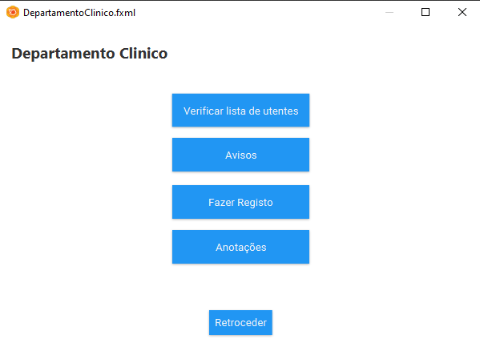

# Project Title

## Contents

- [Team](#team)
- [Vision and Scope](#vision-and-scope)
- [Requirements](#requirements)
    - [Use case diagram](#use-case-diagram)
    - [Mockups](#mockups)
    - [User stories](#user-stories)
- [Definition of Done](#definition-of-done)
- [Architecture and Design](#architecture-and-design)
    - [Domain Model](#domain-model)
- [Risk Plan](#risk-plan)
- [Pre-Game](#pre-game)
- [Release Plan](#release-plan)
  - [Release 1](#release-1)
  - [Release 2](#release-2)
- [Increments](#increments)
  - [Sprint 1](#sprint-1)
  - [Sprint 2](#sprint-2)
  - [Sprint 3](#sprint-3)

## Team

- Leonardo Silva - 2021135858
- Ricardo Tavares - 2021144652
- Daniel Bravo - 2021137795
- Mário Lourenço - 2021129732
- Sandra Perdigão - 2019102697

***

## Vision and Scope

#### Problem Statement

##### Project background

Atualmente, os Lares de Idosos enfrentam um desafio significativo: a disparidade entre o número de residentes idosos e a quantidade de funcionários disponíveis. Isto resulta em dificuldades na prestação adequada de cuidados individualizados a cada idoso. Ao longo dos anos, esta lacuna tem-se agravando devido ao envelhecimento da população e à crescente procura por serviços de cuidados a idosos, enquanto a oferta de profissionais de saúde e cuidadores não tem acompanhado este aumento. Isto resulta numa sobrecarga de trabalho para os funcionários, o que, por sua vez, pode levar a erros na administração de medicamentos, problemas na alimentação dos idosos e a não conformidade com dietas recomendadas. Sem um sistema de gestão adequado, o bem-estar dos idosos pode estar comprometido.

Nesse contexto, um software de gestão especializado para Lares de Idosos desempenha um papel vital. Além de melhorar a
gestão das necessidades dos idosos e a eficiência dos funcionários, ele também garante a administração precisa de
medicamentos e alimentos, proporcionando assim uma qualidade de vida mais elevada para os idosos e tranquilidade para os
seus entes queridos. Portanto, investir em tecnologia de gestão é essencial para enfrentar os desafios atuais e garantir
um futuro mais seguro e satisfatório para a população idosa nas instituições de cuidados.

##### Stakeholders

**1. Lar de Idosos**

- Departamento Clínico: Necessidade de um sistema de gestão que ajude a administrar eficazmente os cuidados de saúde aos utentes, incluindo registos médicos, administração de medicamentos e acompanhamento de condições de saúde.

- Departamento Culinario: Necessidades relacionadas à gestão de dietas e preferências alimentares dos utentes, bem como alergias alimentares dos utentes e planeamento de refeições individualizado.

- Departamento Financeiro: Necessidades relacionadas à gestão financeira do lar, incluindo informação da prestação de cada utente, controlo de custos, etc.

**2. Familiares dos utentes**

- Comunicação com o Lar de Idosos: Necessidade de acesso fácil a informações sobre o bem-estar e atendimento aos seus entes queridos, bem como uma linha de Comunicação direta com a equipa do lar.

**3. Funcionários**

- Gestão dos utentes: Necessidade de uma ferramenta que simplifique o acompanhamento das necessidades indiviuais dos utentes, alocação de tarefas e comunicação interna.

**4. Utentes**

- Melhores condições: Necessidade de um ambiente seguro, confortável e bem administrado, que inclua cuidados de saúde adequados, nutrição adequada, e atenção personalizada para melhorar a sua qualidade de vida.

##### Users
**1. Lar de Idosos**

- Departamento Clínico: Necessidade de um sistema para conter a informação dos medicamentos prescritos para os diferentes utentes, horário de administração, registo de incidentes médicos ou problemas de saúde dos utentes, para um acompanhamento adequado.

- Departamento Culinario: Necessidade de saberas quantidades e tipos de comida a serem preparados a cada dia, levando em consideração alergias alimentares e dietas específicas dos utentes.

- Departamento Financeiro: Necessidade de um sistema que controle as despesas da instituição, incluindo pagamento a funcionários, despesas com alimentação, e outros custos operacionais. Necessidade de registar os pagamentos recebidos por parte dos utentes/ familiares para garantir um registo preciso das finanças do lar.

**2. Familiares dos utentes**

- Necessidade de um sistema que forneça um chat ou estado do processo do utente, permitindo uma comunicação direta com a equipa do lar. Interesse em informações atualizadas sobre a condição e o bem-estar do utente, para tranquilidade e acompanhamento dos familiares.

**3. Funcionários**

- Necessidade de um registo que contenha informações sobre as medicações que cada utente precisa de tomar, garantido uma administração precisa. Interesse em que esteja disponível informação sobre cuidados específicos necessários para cada utente, assim como acesso ao horário de visistas dos utentes para coordenar as interações familiares e garantir o bem-estar dos idosos.

***

#### Vision & Scope of the Solution

##### Vision statement

O objetivo deste projeto é revolucionar a Gestão de Lares de Idosos, para isso será necessário desenvolver um software bastante completo e complexo. Este software não só melhorará a qualidade de vida dos idosos residentes em lares, como também permitirá aos funcionários/utilizadores realizarem as suas tarefas mais acertadamente uma vez que será possivel aceder aos mais diversos dados relativos a cada idoso facilitando o seu trabalho.
Atendendo a estas necessidades críticas dos funcionários e idosos pretende-se ajudar a criar um ambiente mais acolhedor para os residentes de lares.

##### List of features

**Gestão de Medicamentos**

- Providenciar uma plataforma segura na qual os funcionários responsáveis pelos idosos possam verificar a medicação a ser tomada.
- Manter um registo detalhado dos horários da toma dos medicamentos.
- Alertas para os horários de administração de medicamentos.

**Gestão Dietética**

- Planos de refeições personalizados para os idosos tendo em conta as suas restrições dietéticas e alergias.

**Gestão de Pessoal**

- Manter uma base de dados com todos os funcionários do lar,contendo as suas funções e horários.
- Permitir que todos os funcionários tenham acesso aos registos das informações sobre os idosos

**Gestão de Perfis dos Residentes**

- Criar perfis para novos residentes, incluido alergias, preferências ao nivel da alimentação e informações pessoais.
- Armazenar na base de dados fotografias e documentação importante relacionados aos residentes.

**Alertas e Notificações**

- Envio de alertas por parte da gerência aquando a realização de eventos críticos, aniversários, erros de medicação, entre outros.

##### Features that will not be developed

- Não incluiremos a funcionalidade de processar pagamentos para funcionários, fornecedores, utentes.

- Não abordaremos a gestão de stock de alimentos.

- Não haverá integração com sistemas externos de saúde ou segurança social.

- Não iremos desenvolver um sistema de diálogo entre funcionários, familiares e utentes.

- Não iremos gerenciar as finanças da instituição.

##### Assumptions

1. A primeira versão da aplicação será um protótipo disponível como uma aplicação de desktop.
2. A aplicação não recolhe dados por si só, em vez disso, os utilizadores autorizados para cada secção inserem informações dos utentes, das finanças do lar, etc.
3. Parte-se do pressuposto de que os utilizadores inserirão dados fiáveis e precisos apensar das verificações impostas pelo software.
4. A aplicação vai ser desenvolvida para uma única instituição de apoio a idosos que contém 5 funcionários e 20 residentes, cada um com informações únicas.
5. Supõe-se que os utilizadores serão treinados e orientações para usar a aplicação de forma eficaz.

***

## Requirements

### Use Case Diagram

**Departamento Clínico**

**Familiares**

**Funcionários**

**Departamento Culinária**

**Departamento Financeiro**

***

### Mockups

**Login**

**Departamento Clínico**
Os funcionários do departamento clínico podem verificar a lista de utentes, registar a administração de medicamentos, registar problemas de saúde, receber avisos e fazer anotações.

**Familiares**
Os familiares poderam agendar visitas, controlar as medicações e verificar o estado de saúde do utente.

**Funcionários**
Os funcionários terão acesso a informações dos utentes, chat entre outros funcionários para assuntos diversos, cuidar da administração de medicamentos e rotinas de utentes.

**Departamento Culinária**
Os funcionários do departamento de culinária podem fazer planeamento de refeições e analisar informações culinárias de cada utente. Além disso, poderão registar stocks e receber alertas.

**Departamento Financeiro**
Os funcionários do departamento financeiro poderão analisar e adicionar despesas e receitas a nível geral da instituição, assim como analisar e adicionar despesas individuais de utentes.

**Gerência**
Os elementos da gerência terão acesso a diversas informações sobre cada utente, assim como poderão criar vários tipos de avisos.

***

### User Stories

##### User Stories list

- [US1 - Departamento Clínico](https://gitlab.com/ShorMario/gps_g33/-/issues/1)
- [US2 - Familiar](https://gitlab.com/ShorMario/gps_g33/-/issues/2)
- [US3 - Funcionário](https://gitlab.com/ShorMario/gps_g33/-/issues/3)
- [US4 - Departamento Culinária](https://gitlab.com/ShorMario/gps_g33/-/issues/4)
- [US5 - Departamento Financeiro](https://gitlab.com/ShorMario/gps_g33/-/issues/5)
- [US6 - Gerência](https://gitlab.com/ShorMario/gps_g33/-/issues/6)

***
##### User Story 1

**Departamento Clínico**

Como enfermeira do departamento clínico de um lar de idosos quero controlar a administração da medicação dos utentes, bem como fazer o seu acompanhamento do estado de saúde, para isso preciso de ter acesso á informação da medicação e problemas de saúde de cada utente.

###### Acceptance Criteria

1. **Dado** que o enfermeiro entrou no sistema, **quando** ele acede á lista de utentes do lar, ele **deve** ser capaz de visualizar a lista completa de utentes.

2. **Dado** que o enfermeiro está a visualizar a lista de utentes, **quando** o mesmo seleciona um utente **deve** ser capaz de aceder às informações desse utente.

3. **Dado** que o enfermeiro está a visualizar as informações de um utente, **quando** ele navega pelas informações do utente,o mesmo **deve** encontrar detalhes como o tipo de medicamento a tomar, dosagem, horário da administração do medicamento, informações de saúde relevantes e outras informações importantes.

4. **Dado** que o enfermeiro está a visualizar as informações de um utente,**quando** a hora de administração de medicamentos de um utente se aproxima,então o enfermeiro **deve** receber avisos sobre a hora de administração.

5. **Dado** que o enfermeiro está a registar a administração de medicamentos,**quando** ele administra o medicamento ao utente ou se recusa a fazê-lo,ele **deve** registar essa ação no sistema.

6. **Dado** que o enfermeiro está a registar informações de saúde,**quando** ocorre um problema de saúde, então ele **deve** registar os detalhes no sistema.

7. **Dado** que o enfermeiro está a utilizar o sistema, **quando** ele deteta a falta de medicamentos ou falta de utensilios essenciais ao seu trabalho,então ele **deve** ser capaz de fazer esse registo.

***

##### User Story 2

**Familiar**

Como familiar eu quero ter uma maior proximidade com o utente presente no lar,
visto que eu quero conseguir saber o bem-estar, saúde e ter uma comunicação mais fácil.

###### Acceptance Criteria

1. **Dado** que um familiar entrou no sistema, **quando** este seleciona 'Visitas' **deve** conseguir ver o horario de visita
2. **Dado** que um familiar entrou no sistema, **quando** este seleciona 'Medicação' **deve** conseguir ver o horario de medicação
3. **Dado** que um familiar entrou no sistema, **quando** este seleciona 'Contacto' **deve** conseguir comunicar com o utente
4. **Dado** que um familiar entrou no sistema, **quando** este seleciona 'Estado de Saúde' **deve** conseguir ver as consultas do utente.

***

##### User Story 3

**Funcionario**

Como funcionário de um lar de idosos, eu quero poder acessar o sistema para saber quais tarefas a realizar, saber horários de entrada e saída, assim como horas de levantar e deitar utentes.

###### Acceptance Criteria

1. **Dado** que o funcionário está a visualizar a lista de utentes, **quando** este seleciona um utente, **deve** ser capaz de visualizar informações essenciais sobre cada residente.

2. **Dado** que o funcionário entrou no sistema, **quando** este tenta comunicar com outro funcionário para informar acerca de algo ou trocar um turno, **deve** haver uma funcionalidade de chat que permita aos funcionários se comunicarem entre si.

3. **Dado** que o funcionário está a visualizar o registro de horários de administração de medicamentos de cada utente, **quando** este seleciona um utente, este **deve** ser capaz de obter informações relativas aos medicamentos a serem administrados, as doses e os horários.

4. **Dado** que o funcionário está a visualizar o registro de horários de rotina de cada residente, **quando** este seleciona um utente, este **deve** ser capaz de obter informações relativas a horas de acordar e deitar, assim como banhos, trocas de fraldas, atividades didáticas e horas de visita.

***

##### User Story 4

**Departamento Culinário**

Como funcionária no Departamento Culinario de um lar de idosos, quero controlar o planeamento das refeições, garantir que as preferências alimentares e restrições dietéticas dos idosos sejam consideradas, e manter registo de ‘stock’ para garantir que os ingredientes estejam sempre disponíveis.

###### Acceptance Criteria

1. **Dado** que um membro do Dep. Culinario entrou no sistema, **quando** este seleciona 'Planeamento Refeições' **deve** poder visualizar o planeamento de refeições assim como avisos sobre preferências alimentares especiais para alguns idosos.
2. **Dado** que um membro do Dep. Culinario entrou no sistema, **quando** este seleciona 'Preferências Alimentares/Restrições' **deve** conseguir ver as preferências alimentares e restrições dietéticas de cada idoso, incluindo alergias.
3. **Dado** que um membro do Dep. Culinario entrou no sistema, **quando** este seleciona 'Registar Stock' **deve** conseguir registar informações sobre o ‘stock’ de ingredientes, incluindo datas de validade e datas de reposição previstas.

***

##### User Story 5

**Departamento Financeiro**

Como membro da equipe financeira de um lar de idosos, quero ser capaz de gerenciar as finanças da instituição de forma eficaz e transparente. Para isso, preciso ter acesso às informações financeiras relevantes, tais como gastos alimentares, despesas com energia, água, cuidados médicos, manutenção de instalações e outras despesas operacionais essenciais.

###### Acceptance Criteria

1. **Dado** que um membro da equipe financeira acesse o sistema, **quando** este estiver logado, deverá ser capaz de visualizar um resumo das finanças da instituição, incluindo receitas e despesas totais.

2. **Dado** que um membro da equipe financeira acesse o sistema, **quando** este desejar, deverá ser capaz de acessar detalhes financeiros específicos, como relatórios de despesas mensais de cada idoso.

3. **Dado** que um membro da equipe financeira acesse o sistema, **quando** este precisar, deverá ser capaz de registar despesas adicionais e receitas inesperadas no sistema, de forma que as finanças sejam sempre atualizadas e precisas.

4. **Dado** que um membro da equipa financeira aceda ao sistema, **quando** se aproximarem as datas de vencimento das contas a pagar, estes devem receber alertas, a fim de evitar pagamentos em atraso.

***

##### User Story 6

**Gerência**

Como membro da gerência de um lar de idosos, os mesmos deverão ser responsáveis pela organização e gestão de tarefas dos funcionários como tal devem ter a capacidade de os avisar de certas situações. Devem ainda ter a capacidade de verificar os dados pessoais mais relevantes relativos aos idosos do seu lar.

###### Acceptance Criteria

1. **Dado** que um membro da gerência está logado no sistema, **quando** este deseja enviar um aviso aos funcionários,ele **deve** ser capaz de criar e enviar um aviso para os funcionários.

2. **Dado** que um membro da gerência está logado no sistema,
**quando** este deseja verificar informações pessoais de um idoso residente no lar, então ele **deve** ser capaz de selecionar o idoso em específico e visualizar os seus dados pessoais.

***

## Definition of done

(This section is already written, do not edit)
It is a collection of criteria that must be completed for a User Story to be considered “done.”

- All tasks done
  - CI – built, tested (Junit), reviewed (SonarCloud)
  - Merge request to qa (code review)

- Acceptance tests passed

- Accepted by the client

- Code merged to main

***

## Architecture and Design

#### Domain Model

***

### Risk

##### Threshhold of Success

Para que o projeto seja bem sucedido, devemos ter:
- ≥ 50% das ‘user’ stories concluídas
- Acompanhamento da medicação e problemas de saúde de cada utente
- Permitir a gestão de tarefas dos funcionários

**(Adicionar mais)**

##### Risk List

**RSK1 Falta de Experiência em Desenvolvimento de Software**
- RSK1 – PxI: 4x5=20 Nem todos os membros da equipa têm experiência em desenvolvimento de ‘software’ em java o que pode levar a atrasos no desenvolvimento do projeto.

**RSK2 Resistência à mudança**
- RSK2 – PxI: 3x4=12; Pode haver resistência por parte dos funcionários e da equipa de cuidados aos idosos relativamente à adoção da nova tecnologia.

**RSK3 Erros nos dados de entrada**
- RSK3 – PxI: 3x5=15; Pode haver dados incorretos ou imprecisos devido a erros de entrada por parte dos utilizadores autorizados.

**RSK4 Falhas técnicas**
- RSK4 – PxI: 2x5=10; Pode haver falhas técnicas na aplicação que poderiam interromper o funcionamento.

**RSK5 Violações de segurança**
- RSK5 – PxI: 3x5=15; Pode haver violação de segurança de dados que pode comprometer as informações sensíveis dos idosos.

##### Mitigation Actions
(threats>=20)
- RSK1 - AS; Certificar durante os sprints e reuniões se os membros do grupo estão alinhados e resolver eventuais bloqueios.

**Nota:** _Contingency Plan (CP), Avoidance Strategy (AS) or Minimization Strategy (MS)_

***

## Pre-Game
### Sprint 0 Plan

- Goal: Terminar o README e as Mockups do projeto.

- Dates: from 10-13/Oct to 24-27/Oct, 2 weeks

- Roles:
  - Product Owner: Ricardo Tavares
  - Scrum Master: Leonardo Silva

- Sprint 0 Backlog (don't edit this list):
  - Task1 – Write Team
  - Task2 – Write V&S
  - Task3 – Write Requirements
  - Task4 – Write DoD
  - Task5 – Write Architecture&Design
  - Task6 – Write Risk Plan
  - Task7 – Write Pre-Gane
  - Task8 – Write Release Plan
  - Task9 – Write Product Increments
  - Task10 – Create Product Board
  - Task11 – Create Sprint 0 Board
  - Task12 – Write US in PB, estimate (SML), prioritize (MoSCoW), sort
  - Task13 – Create repository with “GPS Git” Workflow

***

## Release Plan

### Release 1

- Goal: MVP - Para a primeira release iremos ter os funcionarios conseguirem ver os dados dos idosos.

- Dates: [teams1] 28-30/Nov
- Release: V1.0

***

### Release 2

- Goal: Para o release final iremos implementar todas as funcionalidades do Departamento Cliníco, Departamento de Culinária, Gerência e os Familiares.
- Date: [teams 0+1] 12-15/Dec
- Release: V2.0

***

## Increments

### Sprint 1
##### Sprint Plan

- Goal: Desenvolver todas as funcionalidades relativas aos funcionárias

- Dates: from 24-27/Oct to 7-10/Nov | 14-17/Nov, 2 | 3 weeks

- Roles:
  - Product Owner: **A ser decidido**
  - Scrum Master: **A ser decidido**

- To do:
  - **US3 - Funcionários**
  - Task1 - Visualizar informações sobre o utente.
  - Task2 - Comunicação interna de funcionários.
  - Task3 - Visualização de medicação a ser administrada a cada utente.
  - Task4 - Visualização de informação relativa a horários do utente.
  
- Story Points: Small: 2, Medium: 1, Large: 1; Total = 2S + 1M + 1L =

- Analysis: short analysis of the planning meeting

##### Sprint Review

- Analysis: what was not done or what was added (Link to US or Task from the PB)

- Story Points: 2S+1M+2X+2H

- Version: 0.1 

- Client analysis: client feedback

- Conclusions: what to add/review

##### Sprint Retrospective

- What we did well:
    - A
- What we did less well:
    - B
- How to improve to the next sprint:
    - C

***

#### Sprint 2

***

#### Sprint 3

***

